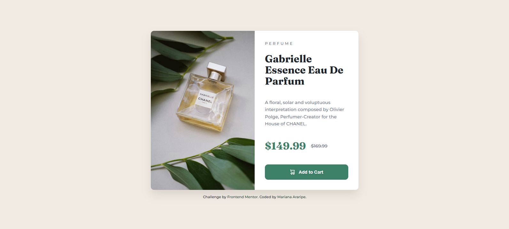
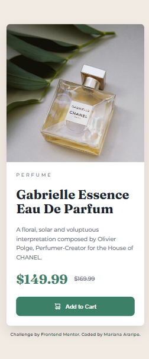

# Frontend Mentor - Product Preview Card Component Solution

Este é um projeto baseado no desafio [Product preview card component](https://www.frontendmentor.io/challenges/product-preview-card-component-GO7UmttRfa) do Frontend Mentor. O desafio consiste em construir um componente de visualização de produto, respeitando o design proposto com atenção a responsividade, estilos e interações visuais.

---

## 🚀 Tecnologias Utilizadas

- HTML5 semântico  
- CSS3 com variáveis personalizadas  
- Flexbox  
- Google Fonts (Montserrat e Fraunces)
- Responsividade com media queries
- `aspect-ratio` para layout quadrado no mobile

---

## 🎯 Objetivo

Praticar a criação de um componente visual com foco em:

- Estruturação com Flexbox
- Responsividade baseada em breakpoints
- Uso moderno de propriedades CSS (`aspect-ratio`, `object-fit`, etc.)
- Fidelidade visual ao design fornecido

---

## 📸 Screenshots

---

## 🔗 Links

- [🔗 Visualizar Projeto](https://marianaararipe.github.io/product-card-responsive/)
- [📁 Repositório no Frontend Mentor](https://www.frontendmentor.io/solutions/responsive-product-preview-card-component-htmlcss-OdrW83mI1G)
- [📂 Código no GitHub](https://github.com/marianaararipe/product-card-responsive)

---

## 💡 O que aprendi/aprimorei

- Como aplicar `box-shadow` para dar profundidade a elementos
- Utilização de `aspect-ratio` para criar áreas quadradas responsivas
- Aplicar fontes diferentes com o Google Fonts
- Organizar layout mobile com `flex-direction:` column de forma fluida
- Organização de classes CSS reutilizáveis
- Acessibilidade básica usando `alt` e `aria-label `

---

## 📚 Recursos úteis

- [Using media queries](https://developer.mozilla.org/en-US/docs/Web/CSS/CSS_media_queries/Using_media_queries)  
  Explica como usar media queries para adaptar o layout do seu site a diferentes tamanhos de tela, criando uma experiência responsiva em dispositivos móveis, tablets e desktops.
- [Imagens responsivas](https://web.dev/learn/design/responsive-images?hl=pt-br)  
  Ensina como otimizar imagens para que carreguem corretamente e com boa performance em qualquer resolução de tela.
- [Documentação de aspect-ratio](https://developer.mozilla.org/en-US/docs/Web/CSS/aspect-ratio)  
  Permite definir uma razão entre largura e altura sem usar `padding hacks`.
- [Flexbox Froggy (joguinho)](https://flexboxfroggy.com/)  
  Um jeito divertido de aprender Flexbox.

---

## 👤 Autor

- **GitHub:** [@marianaararipe](https://github.com/marianaararipe)  
- **Frontend Mentor:** [@marianaararipe](https://www.frontendmentor.io/profile/marianaararipe)
